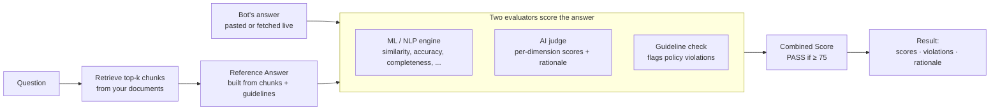
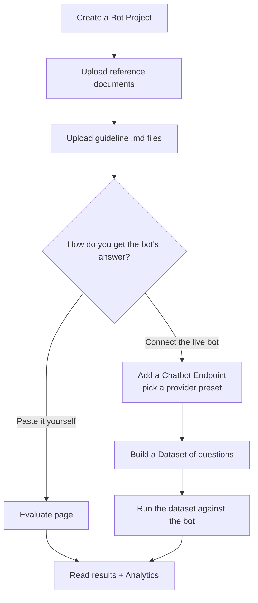

# How EvalBot works

EvalBot checks your chatbot's answer against a **reference answer** it builds from
**your own documents and rules** — then scores how close the bot got, and flags any
rule it broke. Two scorers run: a fast math-based one and an AI judge.

> New to the terms in **bold**? See the [Glossary](glossary.md).

## The scoring pipeline



**Step by step:**
1. **Retrieve** — EvalBot pulls the most relevant chunks of *your* documents for the question.
2. **Reference Answer** — an LLM writes the "correct" answer using only those chunks + your guideline files.
3. **Score** — your bot's answer is graded two ways at once:
   - **ML/NLP engine** — math only, no API calls. Measures similarity, accuracy, completeness, etc.
   - **AI judge** — an LLM that scores each dimension and explains itself in plain English.
   - **Guideline check** — the AI judge reads your rules and flags any the answer breaks, quoting the offending sentence.
4. **Combine** — the two scores merge into a **Combined Score**. Default pass mark: **75**.

```
combined    = 0.35·similarity + 0.25·accuracy + 0.25·completeness + 0.10·relevance + 0.05·readability
final_score = (ml_score + ai_score) / 2      # when both engines run
PASS        = final_score ≥ 75
```

When the two engines **disagree** a lot, that's a useful signal on its own (shown in Analytics).

## The user workflow



Ready to try it? See the [Usage guide](usage.md).
